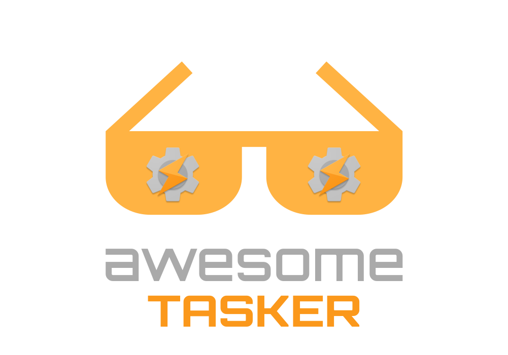

	

 

> Carefully curated list of awesome Tasker projects, tutorials and tricks

[Tasker](https://play.google.com/store/apps/details?id=net.dinglisch.android.taskerm) is an application for Android which performs tasks (sets of actions) based on contexts (application, time, date, location, event, gesture) in user-defined profiles or in clickable or timer home screen widgets.
This simple concept profoundly extends your control of your Android device and it's capabilities, without the need for 'root' or a special home screen.

Tasker came 3rd in the Productivity category in the Android Developer Challenge 2.

 

	<a href="awesome.md">What is an awesome list?</a>&nbsp;&nbsp;&nbsp;
	<a href="contributing.md">Contribution guide</a>&nbsp;&nbsp;&nbsp;

 

	
        Follow me on <a href="https://www.linkedin.com/in/guilhermemaciel/">LinkedIn</a>.

 

## Contents
- [Official](#official)
- [Plugins](#plugins)
- [Books](#books)
- [Videos](#videos)
- [Assets](#assets)
- [Blogs](#blogs)
- [Community](#community)

## Official
- [Website](https://tasker.joaoapps.com/) - Website with all apps.
- [Guides](https://tasker.joaoapps.com/guides.html) - Guides from Joao.
- [Wiki](http://tasker.wikidot.com/) - Official wiki.
- [Support](https://groups.google.com/forum/#!forum/tasker) - Support group.
- [Forum](https://forum.joaoapps.com/index.php) - Official forum.
- [FAQ](https://tasker.joaoapps.com/faq.html) - Official FAQ.
- [App](https://tasker.joaoapps.com/download.html) - From website.
- [App](https://play.google.com/store/apps/details?id=net.dinglisch.android.taskerm) - From Google Play™ store.
- [Videos](https://www.youtube.com/user/joaomgcd) - Videos from Joao.
- [Documentation](https://github.com/joaomgcd/TaskerDocumentation) - Crowdsourced documentation for Tasker.

## Plugins
### [Official Plugins](https://play.google.com/store/apps/details?id=com.joaomgcd.autoappshub) - (Paid | Free)
- [AutoApps](https://play.google.com/store/apps/details?id=com.joaomgcd.autoappshub) - Allows you to unlock (as individual purchases) all the Tasker plugins by the same developer, known as the AutoApps.
- [AutoVoice](https://play.google.com/store/apps/details?id=com.joaomgcd.autovoice) (and the [pro key](https://play.google.com/store/apps/details?id=com.joaomgcd.autovoice.unlock)) - Custom voice commands for Google Now™.
- [Tasker Settings](https://play.google.com/store/apps/details?id=com.joaomgcd.taskersettings) - Helper app for Tasker; It allows to change some settings that Tasker can't change by itself.
- [AutoInput](https://play.google.com/store/apps/details?id=com.joaomgcd.autoinput) - Enables to interact with any Android™ app automatically. It also allows you to get info from other apps so you can use it in Tasker.
- [AutoCast](https://play.google.com/store/apps/details?id=com.joaomgcd.autocast) (And the [pro key](https://play.google.com/store/apps/details?id=com.joaomgcd.autocast.unlock)) - Gives full control over your Chromecast™.
- [Tasker App Factory](https://play.google.com/store/apps/details?id=net.dinglisch.android.appfactory) - Generate an app from a task or project.
- [AutoNotification](https://play.google.com/store/apps/details?id=com.joaomgcd.autonotification) (And the [pro key](https://play.google.com/store/apps/details?id=com.joaomgcd.autonotification.unlock)) - Can create notifications in Tasker.
- [AutoTools](https://play.google.com/store/apps/details?id=com.joaomgcd.autotools) - Adds extra functionality for Tasker.
- [AutoContacts](https://play.google.com/store/apps/details?id=com.joaomgcd.autocontacts) (And the [pro key](https://play.google.com/store/apps/details?id=com.joaomgcd.autocontacts.unlock)) - Query contacts in Tasker.
- [AutoTools Root Add-on](https://play.google.com/store/apps/details?id=com.joaomgcd.autotoolsroot) - Unlock AutoTools root features.
- [AutoWear](https://play.google.com/store/apps/details?id=com.joaomgcd.autowear) - Enables to completely customize devices that uses Wear OS by Google™.
- [AutoShare](https://play.google.com/store/apps/details?id=com.joaomgcd.autoshare) (And the [pro key](https://play.google.com/store/apps/details?id=com.joaomgcd.autoshare.unlock)) - Send text or files to Tasker from any app and react to it however you want;
Also share text from Tasker to any other app that supports text sharing.
- [AutoShortcut](https://play.google.com/store/apps/details?id=com.joaomgcd.autoshortcut) - Allows you to run any of your installed apps' shortcuts.
- [AutoWeb](https://play.google.com/store/apps/details?id=com.joaomgcd.autoweb) (Beta) - Interact with web and api's from Tasker.
- [AutoLaunch](https://play.google.com/store/apps/details?id=com.joaomgcd.autoapps) (And the [pro key](https://play.google.com/store/apps/details?id=com.joaomgcd.autolaunch.unlock)) - Dynamically launch apps.
- [AutoRemote](https://play.google.com/store/apps/details?id=com.joaomgcd.autoremote) - Remotely control your phone, PC and web.
- [AutoRemoteLite](https://play.google.com/store/apps/details?id=com.joaomgcd.autoremote.lite) - Remotely control your phone, PC and web but with some limitations.
- [AutoApp For Pebble](https://play.google.com/store/apps/details?id=com.joaomgcd.autopebble) (And the [pro key](https://play.google.com/store/apps/details?id=com.joaomgcd.autopebble.unlock)) - Allows to customize your Pebble™ watch.
- [AutoAlarm](https://play.google.com/store/apps/details?id=com.joaomgcd.autoalarm) - Make Tasker able to interact with Android™ alarm.
- [AutoApp for Arduino](https://play.google.com/store/apps/details?id=com.joaomgcd.autoarduino) - Allows to control ARDUINO® pins right from Tasker.
- [AutoVera](https://play.google.com/store/apps/details?id=com.joaomgcd.autovera) (And the [pro key](https://play.google.com/store/apps/details?id=com.joaomgcd.autovera.unlock)) - Makes Tasker interact with home automation gadgets.
- [AutoMEO](https://play.google.com/store/apps/details?id=com.joaomgcd.automeo) - Makes Tasker interact with MEOBox.
- [AutoLocation](https://play.google.com/store/apps/details?id=com.joaomgcd.autolocation) (And the [pro key](https://play.google.com/store/apps/details?id=com.joaomgcd.autolocation.unlock)) - React to geofences and activities in Tasker.
- [AutoBarcode](https://play.google.com/store/apps/details?id=com.joaomgcd.barcode) - Allows you to completely automate your phone with QR Codes.
- [AutoBarcodeLite](https://play.google.com/store/apps/details?id=com.joaomgcd.barcode.lite) - Allows you to completely automate your phone with QR Codes but limited to 3 character scans.
- [AutoBluetooth](https://play.google.com/store/apps/details?id=com.joaomgcd.autobluetooth) - Makes Tasker interact with bluetooth.
- [AutoBubbles](https://play.google.com/store/apps/details?id=com.joaomgcd.autobubbles) - Enables Tasker to create movable/draggle icons that float above everything else on the screen display.
- [AutoCalendar](https://play.google.com/store/apps/details?id=com.joaomgcd.autocalendar) - Allows Tasker to interact with calendar.
- [AutoMail](https://play.google.com/store/apps/details?id=com.joaomgcd.autogmail) - Automate emails other than Gmail.
- [AutoMediaButtons](https://play.google.com/store/apps/details?id=com.joaomgcd.automediabuttons) - Enables Tasker to interact with media buttons.
- [AutoMEO](https://play.google.com/store/apps/details?id=com.joaomgcd.automeo) - Enables Tasker to control a [MeoBox](https://www.meo.pt/en).
- [AutoPhoto](https://play.google.com/store/apps/details?id=com.joaomgcd.autophoto) - Enables Tasker to interact with pictures.
- [AutoRSS](https://play.google.com/store/apps/details?id=com.joaomgcd.autorss) - Enables Tasker to interact with [RSS](https://en.wikipedia.org/wiki/RSS).
- [AutoSheets](https://play.google.com/store/apps/details?id=com.joaomgcd.autosheets) - Tasker plugin that allows to automate just about anything in [Google Sheets](http://sheets.google.com)
- [TaskerSettings](https://github.com/joaomgcd/TaskerSettings) - Enables Tasker to toggle WI-FI.
### Marco Stornelli
- [SecureTask](https://play.google.com/store/apps/details?id=com.balda.securetask) - Makes Tasker interact with [Secure Settings](https://play.google.com/store/apps/details?id=com.intangibleobject.securesettings.plugin&hl=en_CA).
- [MailTask](https://play.google.com/store/apps/details?id=com.balda.mailtask) - Enables Tasker to interact with emails.
- [TouchTask](https://play.google.com/store/apps/details?id=com.balda.touchtask) - Perform gestures automatically without root.
- [ContactsTask](https://play.google.com/store/apps/details?id=com.balda.contactstask) - Read contacts from device.
- [AirTask](https://play.google.com/store/apps/details?id=com.balda.airtask) - Allows to send messages or files from one device to another using wifi or bluetooth.
- [DriveTask](https://play.google.com/store/apps/details?id=com.balda.drivetask) - Allows to perform operations on Google Drive™.
- [CalendarTask](https://play.google.com/store/apps/details?id=com.balda.calendartask) - Allows to interact with calendar.
- [QuickTask](https://play.google.com/store/apps/details?id=com.balda.quicktask) - Create custom tiles and create events in Tasker to react on.
- [UiTask](https://play.google.com/store/apps/details?id=com.balda.uitask) - Show simple dialogs and pickers using material design.
- [CastTask](https://play.google.com/store/apps/details?id=com.balda.casttask) - Allows you to cast multimedia content using Tasker.
- [ParseTask](https://play.google.com/store/apps/details?id=com.balda.parsetask) - Read data in JSON, XML and HTML.
- [NFC for Tasker](https://play.google.com/store/apps/details?id=com.balda.nfcfortasker) - Read and write on NFC tags using Tasker.
- [Notification Listener](https://play.google.com/store/apps/details?id=com.balda.notificationlistener)- Read notification of other apps.
- [IntentTask](https://play.google.com/store/apps/details?id=com.balda.intenttask) - Allows Tasker to send Android™ intents.
- [MeteoTask](https://play.google.com/store/apps/details?id=com.balda.meteotask) - Get weather information on Tasker.
- [ActivityTask](https://play.google.com/store/apps/details?id=com.balda.autoactivity) - Detect when you are in a vehicle, on foot, on bike, still or if the phone is tilting.
- [ClockTask](https://play.google.com/store/apps/details?id=com.balda.clocktask) - Interact with Android™ clock app.
- [BlueTask](https://play.google.com/store/apps/details?id=com.balda.bluetask) - Allows audio routing using bluetooth headset.
- [GeoTask](https://play.google.com/store/apps/details?id=com.balda.geotask) - Create geographic areas to be monitored.
- [Auto Speed Trap](https://play.google.com/store/apps/details?id=com.balda.autospeedtrap) - Automate the start and stop of [Speed Trap](https://play.google.com/store/apps/details?id=com.balda.speedtrappro&hl=en_CA).
- [Tasker Now](https://play.google.com/store/apps/details?id=com.balda.taskernow) - Use Google Assistant as input for Tasker from your phone or smartwatch.
### Others Vendors
- [Tasker Network Event Server](https://play.google.com/store/apps/details?id=bidoismorgan.httpevent) - Enables Tasker to trigger events when receiving messages over network.
- [HTTP Request Shortcuts](https://play.google.com/store/apps/details?id=ch.rmy.android.http_shortcuts) - Enables Tasker to place shortcuts/widgets on homescreen to submit HTTP requests.
- [Notifications Off](https://play.google.com/store/apps/details?id=com.aboutmycode.NotificationsOff) - Enables Tasker to manage app notifications in a centralized way.
- [ADB Shell](https://play.google.com/store/apps/details?id=com.ADBPlugin) - Enables Tasker to send a (series of) [ADB](https://developer.android.com/studio/command-line/adb) Shell command(s) to a remote device (or the device itself) that has ADB over WiFi enabled.
- [SharpTools Tasker Plugin & Widgets for SmartThings](https://play.google.com/store/apps/details?id=com.boshdirect.stwidgets) - [SharpTools](https://sharptools.io/) is a set of Widgets and Tasker plugins for the SmartThings™ platform.
- [Jewish Tasker Plugin](https://play.google.com/store/apps/details?id=com.chaimchaikin.jewishdatetasker) - Tasker plugin to get the Jewish/Hebrew Date and Zmanim.
- [RepetiTouch Pro](https://play.google.com/store/apps/details?id=com.cygery.repetitouch.pro) - RepetiTouch enables easy recording and replaying of touch events.

### Integrations/Utilities
- [Termux Tasker](https://github.com/termux/termux-tasker) - Run termux commands from tasker
- [Tasker Permissions](https://github.com/joaomgcd/Tasker-Permissions) - Utility to easily grant Tasker permissions
- [Tasker Settings](https://github.com/joaomgcd/TaskerSettings) - Helper app for Tasker

## Assets
- [AutoTools Presets](https://joaoapps.com/autotools/web-screen-presets/) - List of web screen presets that can be imported into AutoTools.
- [Taskernet Collector](https://pghant.github.io/taskernet-collector/search?q=share) - Search Taskernet shares that were publicly posted on Reddit.
- [TaskerPluginSample](https://github.com/joaomgcd/TaskerPluginSample) - Plugin sample for developers.

## Books
- [Developing Android on Android](https://learning.oreilly.com/library/view/developing-android-on/9781941222386/f_0042.html)

## Videos
- [NotEnoughTECH](https://www.youtube.com/user/Polepositionpage) channel
- [Tasker Tutorials](https://www.youtube.com/user/taskertutorials) channel

## Blogs
- [NotEnoughTECH](https://notenoughtech.com/) - Includes multiple posts about Tasker
- [What is Tasker and how does it work?](https://www.androidcentral.com/tasker)
- [A beginner's guide to Tasker: How to automate (almost) anything on your phone](https://www.androidpolice.com/2020/06/14/a-beginners-guide-to-tasker-how-to-automate-almost-anything-on-your-phone/)

## Community
- [Reddit](https://www.reddit.com/r/tasker/)
	- [TaskerFiles](https://www.reddit.com/r/TaskerFiles/)
	- [taskernet](https://www.reddit.com/r/taskernet/)
	- [TaskerIdeas](https://www.reddit.com/r/TaskerIdeas/)
- [StackOverflow](https://stackoverflow.com/questions/tagged/tasker)
- Telegram
	- [TaskerSuperBrasil](https://t.me/TaskerSuperBrasil) group (Brazilian Portuguese)
	- [TaskerSuperBrasilCanal](https://t.me/TaskerSuperBrasilCanal) channel (Brazilian Portuguese)
	- [Tasker Profile Center](https://t.me/tasker_tpc_channel) channel
	- [Tasker中文交流群组](https://t.me/cntasker) group (Chinese)
- Facebook
	- [TaskerSuperBrasil](https://www.facebook.com/TaskerSuperBrasil) page (Brazilian Portuguese)
	- [TaskerSuperBrasil](https://www.facebook.com/groups/TaskerSuperBrasil) group (Brazilian Portuguese)
	- [Android Tasker Community](https://www.facebook.com/groups/taskercommunity/) group
	- [Tasker App Brasil](https://www.facebook.com/groups/339632912856580/) group (Brazilian Portuguese)
- Blogs
	- [Tasker Profile Center](https://taskerprofilecenter.blogspot.com/)
